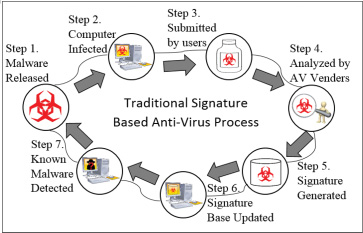

# Survey on Malware Detection Using Data Mining Techniques

- 

  

signature-based method

​	简单易用、但是由于恶意样本越来越多，恶意软件生成门槛越来越低，无经验者也能用完善的工具生成自定义的恶意软件。新的恶意样本大量产生并且变异来规避该方法的检测。

​	传统上，签名通常是由有经验的专家手动分析提取生成的。该过程需要耗费大量的时间和人力。并且从恶意软件发布到能够被检测中间存在时间窗口，使得恶意样本在窗口期间不能被检测。研究显示该时间窗口大约是54天，更糟糕的是15%的恶意样本在180天后依旧不能被检测。

Heuristic-based Malware Detection

​	启发式方法是基于专家定义的规则/模式进行检测匹配 。匹配规则/模式应该对恶意样本有通用性，并且不会使良性文件造成假阳性匹配。构建该规则的过程一般由有经验的专家手动完成，该过程是易出错且十分耗时的。该手动分析过程渐成恶意软件分析瓶颈。

Cloud-based Malware Detection

​	由于恶意样本越来越多，并且每天会产生大量的新的恶意样本，客户端已经无法完成完整的检测工作，因此基于云服务器的检测流程产生。客户端首先进行本地的轻型指纹库的检测匹配，对于无法判断的文件，将文件信息或者是原始文件发送给云服务器，由云服务器进行判定后返回检测结果和解决方案。基于云服务起的检测流程并没有在检测方法上进行创新，只是为了应对越来越多的恶意样本库而采用的client-server模式。

malware detection based on data mining techinques

通常是两个步骤：

two stages:

- feature extraction
- classification/clustering

