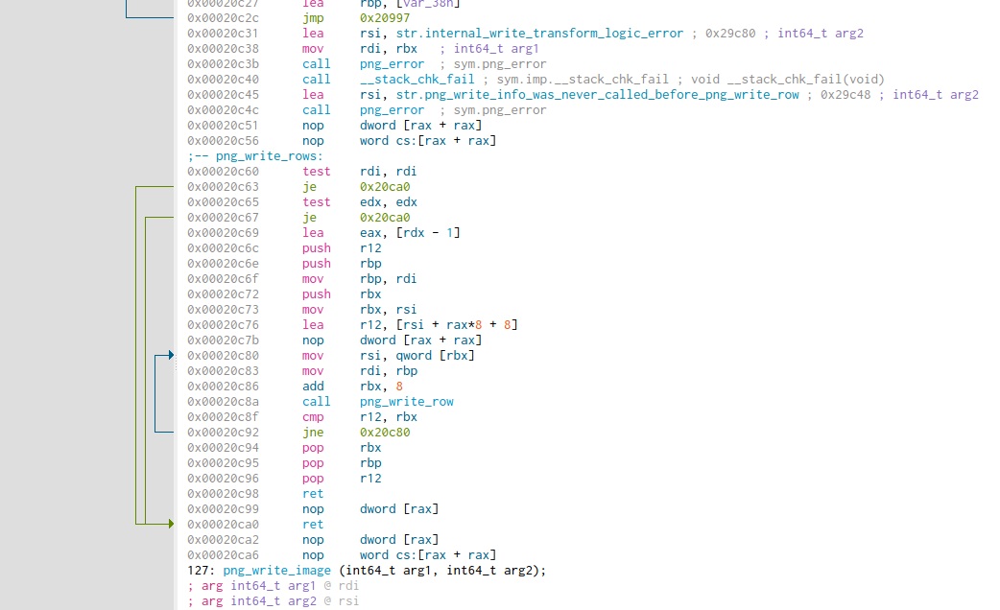

# Comparison

https://blog.quarkslab.com/an-experimental-study-of-different-binary-exporters.html

https://en.wikibooks.org/wiki/X86_Disassembly/Disassemblers_and_Decompilers


## Objdump

GNU工具套件中的标准反汇编工具。

objdump 没有python bindings，仅能使用字符串处理的方法读取内容


## [Capstone](https://www.capstone-engine.org/)

homepage: https://www.capstone-engine.org/

install on Ubuntu:

```shell
sudo apt-get install libcapstone3
```

该步骤会在系统的`/usr/lib/`下安装`libcapstone.so`文件。

如果想自己进行工具开发，需要安装:

```shell
sudo apt-get install libcapstone-dev
```

在系统文件夹下安装`libcapstone.a`文件。

python bindings:

```shell
sudo pip install capstone
```

该方法直接在python 的site-packages 文件夹下安装capstone 的python bindings的源代码，并且在python bindings 的文件夹下有lib文件夹，里面存储`libcapstone.so`文件，因此，pip 安装python bindings后直接引用的是自己的.so 问价，不需要使用系统`/usr/lib/`下的动态链接库。


### Issues

capstone 只能执行代码的反汇编任务，不能识别文件并区分代码段和数据段。传入的数据全部看作是代码字节数据。

解决方法: 使用pyelftools 配合，首先进行文件分析，获取相关参数和代码段数据后传递给capstone。

https://medium.com/sector443/python-for-reverse-engineering-1-elf-binaries-e31e92c33732

https://stackoverflow.com/questions/37439627/which-bytes-should-i-pass-to-capstone-to-disassemble-the-executable-code-of-a-pe


## Plasma

https://github.com/plasma-disassembler/plasma

The old project name was **Reverse**.

`PLASMA` is an interactive disassembler.


## [Radare2](https://github.com/radareorg/radare2)

homepage: https://www.radare.org/


python r2pipe

http://beta.rada.re/en/latest/scripting.html

https://www.megabeets.net/a-journey-into-radare-2-part-1/#radare2_commands

https://github.com/ifding/radare2-tutorial


安装radare2

```
sys/install.sh
```


安装r2pipe

```shell
pip install r2pipe
```

https://stackoverflow.com/questions/55402547/how-to-dump-functions-disassembly-using-r2pipe

https://www.programcreek.com/python/example/94789/r2pipe.open


```python
>>> funcs = r2.cmdj("aflj")
>>> funcs[0]
{'offset': 17632, 'name': 'entry0', 'size': 50, 'is-pure': 'false', 'realsz': 40, 'noreturn': False, 'stackframe': 8, 'calltype': 'amd64', 'cost': 18, 'cc': 4, 'bits': 64, 'type': 'fcn', 'nbbs': 4, 'edges': 4, 'ebbs': 2, 'signature': 'entry0 ();', 'minbound': 17632, 'maxbound': 17682, 'callrefs': [{'addr': 17680, 'type': 'CODE', 'at': 17653}, {'addr': 17680, 'type': 'CODE', 'at': 17665}], 'datarefs': [2297864, 2297864, 2297808], 'codexrefs': [{'addr': 17811, 'type': 'CALL', 'at': 17632}, {'addr': 17653, 'type': 'CODE', 'at': 17680}, {'addr': 17665, 'type': 'CODE', 'at': 17680}], 'dataxrefs': [], 'indegree': 3, 'outdegree': 0, 'nlocals': 0, 'nargs': 0, 'bpvars': [], 'spvars': [], 'regvars': [], 'difftype': 'new'}
>>> f= funcs[0]
>>> print(r2.cmd('pdf @%s' % f['offset']))
            ; CALL XREF from entry.fini0 @ 0x4593
            ;-- section..text:
            ;-- rip:
┌ 40: entry0 ();
│           0x000044e0      488d3d21cb22.  lea rdi, section..bss       ; 0x231008 ; [13] -r-x section size 138744 named .text
│           0x000044e7      55             push rbp
│           0x000044e8      488d0519cb22.  lea rax, section..bss       ; 0x231008
│           0x000044ef      4839f8         cmp rax, rdi
│           0x000044f2      4889e5         mov rbp, rsp
│       ┌─< 0x000044f5      7419           je 0x4510
│       │   0x000044f7      488b05d2ca22.  mov rax, qword [reloc._ITM_deregisterTMCloneTable] ; [0x230fd0:8]=0
│       │   0x000044fe      4885c0         test rax, rax
│      ┌──< 0x00004501      740d           je 0x4510
│      ││   0x00004503      5d             pop rbp
│      ││   0x00004504      ffe0           jmp rax
..
│      ││   ; CODE XREFS from entry0 @ 0x44f5, 0x4501
│      └└─> 0x00004510      5d             pop rbp
└           0x00004511      c3             ret

>>> asm = r2.cmdj("pDj %u @ %s" % (f['realsz'], f['offset']))
>>> for i in asm:
...     print(i)
... 
{'offset': 17632, 'ptr': 2297864, 'esil': '0x22cb21,rip,+,rdi,=', 'refptr': True, 'fcn_addr': 17632, 'fcn_last': 17675, 'size': 7, 'opcode': 'lea rdi, [rip + 0x22cb21]', 'disasm': 'lea rdi, [section..bss]', 'bytes': '488d3d21cb2200', 'family': 'cpu', 'type': 'lea', 'reloc': False, 'type_num': 33, 'type2_num': 0, 'flags': ['entry0', 'section..text', 'rip'], 'comment': 'WzEzXSAtci14IHNlY3Rpb24gc2l6ZSAxMzg3NDQgbmFtZWQgLnRleHQ=', 'refs': [{'addr': 2297864, 'type': 'DATA'}], 'xrefs': [{'addr': 17811, 'type': 'CALL'}]}
{'offset': 17639, 'esil': 'rbp,8,rsp,-,=[8],8,rsp,-=', 'refptr': False, 'fcn_addr': 17632, 'fcn_last': 17681, 'size': 1, 'opcode': 'push rbp', 'disasm': 'push rbp', 'bytes': '55', 'family': 'cpu', 'type': 'rpush', 'reloc': False, 'type_num': 268435468, 'type2_num': 0}
{'offset': 17640, 'ptr': 2297864, 'esil': '0x22cb19,rip,+,rax,=', 'refptr': True, 'fcn_addr': 17632, 'fcn_last': 17675, 'size': 7, 'opcode': 'lea rax, [rip + 0x22cb19]', 'disasm': 'lea rax, [section..bss]', 'bytes': '488d0519cb2200', 'family': 'cpu', 'type': 'lea', 'reloc': False, 'type_num': 33, 'type2_num': 0, 'refs': [{'addr': 2297864, 'type': 'DATA'}]}
{'offset': 17647, 'esil': 'rdi,rax,==,$z,zf,:=,64,$b,cf,:=,$p,pf,:=,63,$s,sf,:=,63,$o,of,:=', 'refptr': False, 'fcn_addr': 17632, 'fcn_last': 17679, 'size': 3, 'opcode': 'cmp rax, rdi', 'disasm': 'cmp rax, rdi', 'bytes': '4839f8', 'family': 'cpu', 'type': 'cmp', 'reloc': False, 'type_num': 15, 'type2_num': 0}
{'offset': 17650, 'esil': 'rsp,rbp,=', 'refptr': False, 'fcn_addr': 17632, 'fcn_last': 17679, 'size': 3, 'opcode': 'mov rbp, rsp', 'disasm': 'mov rbp, rsp', 'bytes': '4889e5', 'family': 'cpu', 'type': 'mov', 'reloc': False, 'type_num': 9, 'type2_num': 0}
{'offset': 17653, 'esil': 'zf,?{,17680,rip,=,}', 'refptr': False, 'fcn_addr': 17632, 'fcn_last': 17680, 'size': 2, 'opcode': 'je 0x4510', 'disasm': 'je 0x4510', 'bytes': '7419', 'family': 'cpu', 'type': 'cjmp', 'reloc': False, 'type_num': 2147483649, 'type2_num': 0, 'jump': 17680, 'fail': 17655, 'refs': [{'addr': 17680, 'type': 'CODE'}]}
{'offset': 17655, 'ptr': 2297808, 'esil': '0x22cad2,rip,+,[8],rax,=', 'refptr': True, 'fcn_addr': 17632, 'fcn_last': 17675, 'size': 7, 'opcode': 'mov rax, qword [rip + 0x22cad2]', 'disasm': 'mov rax, qword [reloc._ITM_deregisterTMCloneTable]', 'bytes': '488b05d2ca2200', 'family': 'cpu', 'type': 'mov', 'reloc': False, 'type_num': 9, 'type2_num': 0, 'refs': [{'addr': 2297808, 'type': 'DATA'}]}
{'offset': 17662, 'esil': '0,rax,rax,&,==,$z,zf,:=,$p,pf,:=,63,$s,sf,:=,0,cf,:=,0,of,:=', 'refptr': False, 'fcn_addr': 17632, 'fcn_last': 17679, 'size': 3, 'opcode': 'test rax, rax', 'disasm': 'test rax, rax', 'bytes': '4885c0', 'family': 'cpu', 'type': 'acmp', 'reloc': False, 'type_num': 16, 'type2_num': 0}
{'offset': 17665, 'esil': 'zf,?{,17680,rip,=,}', 'refptr': False, 'fcn_addr': 17632, 'fcn_last': 17680, 'size': 2, 'opcode': 'je 0x4510', 'disasm': 'je 0x4510', 'bytes': '740d', 'family': 'cpu', 'type': 'cjmp', 'reloc': False, 'type_num': 2147483649, 'type2_num': 0, 'jump': 17680, 'fail': 17667, 'refs': [{'addr': 17680, 'type': 'CODE'}]}
{'offset': 17667, 'esil': 'rsp,[8],rbp,=,8,rsp,+=', 'refptr': False, 'fcn_addr': 17632, 'fcn_last': 17681, 'size': 1, 'opcode': 'pop rbp', 'disasm': 'pop rbp', 'bytes': '5d', 'family': 'cpu', 'type': 'pop', 'reloc': False, 'type_num': 14, 'type2_num': 0}
{'offset': 17668, 'esil': 'rax,rip,=', 'refptr': False, 'fcn_addr': 17632, 'fcn_last': 17680, 'size': 2, 'opcode': 'jmp rax', 'disasm': 'jmp rax', 'bytes': 'ffe0', 'family': 'cpu', 'type': 'rjmp', 'reloc': False, 'type_num': 268435458, 'type2_num': 0}
{'offset': 17670, 'size': 1, 'type': 'invalid'}
{'offset': 17671, 'size': 1, 'type': 'invalid'}
```

IDA 结果：

```shell
.text:00000000000044E0 ; ===========================================================================
.text:00000000000044E0
.text:00000000000044E0 ; Segment type: Pure code
.text:00000000000044E0 ; Segment permissions: Read/Execute
.text:00000000000044E0 _text           segment para public 'CODE' use64
.text:00000000000044E0                 assume cs:_text
.text:00000000000044E0                 ;org 44E0h
.text:00000000000044E0                 assume es:nothing, ss:nothing, ds:_data, fs:nothing, gs:nothing
.text:00000000000044E0
.text:00000000000044E0 ; =============== S U B R O U T I N E =======================================
.text:00000000000044E0
.text:00000000000044E0 ; Attributes: bp-based frame
.text:00000000000044E0
.text:00000000000044E0                 public start
.text:00000000000044E0 start           proc near               ; CODE XREF: sub_4570:loc_4593↓p
.text:00000000000044E0                                         ; DATA XREF: LOAD:0000000000000018↑o
.text:00000000000044E0                 lea     rdi, byte_231008
.text:00000000000044E7                 push    rbp
.text:00000000000044E8                 lea     rax, byte_231008
.text:00000000000044EF                 cmp     rax, rdi
.text:00000000000044F2                 mov     rbp, rsp
.text:00000000000044F5                 jz      short loc_4510
.text:00000000000044F7                 mov     rax, cs:_ITM_deregisterTMCloneTable_ptr
.text:00000000000044FE                 test    rax, rax
.text:0000000000004501                 jz      short loc_4510
.text:0000000000004503                 pop     rbp
.text:0000000000004504                 jmp     rax
.text:0000000000004504 ; ---------------------------------------------------------------------------
.text:0000000000004506                 align 10h
.text:0000000000004510
.text:0000000000004510 loc_4510:                               ; CODE XREF: start+15↑j
.text:0000000000004510                                         ; start+21↑j
.text:0000000000004510                 pop     rbp
.text:0000000000004511                 retn
.text:0000000000004511 start           endp
.text:0000000000004511
.text:0000000000004511 ; ---------------------------------------------------------------------------
.text:0000000000004512                 align 20h
.text:0000000000004520
.text:0000000000004520 ; =============== S U B R O U T I N E =======================================
```


根据IDA 结果可见，该函数中有两处字节补齐，一次在4506处，然而radare2的asm最后两行没有解出，原因未知。


nop指令

https://stackoverflow.com/questions/43991155/what-does-nop-dword-ptr-raxrax-x64-assembly-instruction-do

```
Length    Assembly                                     Byte Sequence
-------   ------------------------------------------   --------------------------
1 byte    nop                                          90
2 bytes   66 nop                                       66 90
3 bytes   nop dword ptr [eax]                          0F 1F 00
4 bytes   nop dword ptr [eax + 00h]                    0F 1F 40 00
5 bytes   nop dword ptr [eax + eax*1 + 00h]            0F 1F 44 00 00
6 bytes   66 nop word ptr [eax + eax*1 + 00h]          66 0F 1F 44 00 00
7 bytes   nop dword ptr [eax + 00000000h]              0F 1F 80 00 00 00 00
8 bytes   nop dword ptr [eax + eax*1 + 00000000h]      0F 1F 84 00 00 00 00 00
9 bytes   66 nop word ptr [eax + eax*1 + 00000000h]    66 0F 1F 84 00 00 00 00 00
```


### Issues

- 执行完命令后首先得到的是控制台打印帮助信息，再执行一遍命令得到想要的结果。
- 两个函数识别为了一个。例如libpng.1.6.34.so中的`png_wirte_row`和后面的函数`png_write_rows`的代码均划给了前者。
- 代码中的对齐字节识别错误。nop和align出有时出错，出错情况往往是大于 9bytes 对齐的时候。


### Cutter

Free and Open Source RE Platform powered by radare2

我们使用Cutter通过图形化的方式检查了上述的问题。



从图中可以看出图形化的工具Cutter也就没有把`png_write_rows`视为一个函数，因为函数会在第一行名字前有函数id。调用关系为`png_write_rows`调用`png_write_row`。Cutter是基于radare2的GUI工具，所以结果没变，依旧有函数识别问题。


### vs Ghidra

```shell
                         LAB_00120c45                                    XREF[1]:     0012085c(j)  
    00120c45 48 8d 35        LEA        RSI,[s_png_write_info_was_never_called_b_00129   = "png_write_info was never call
             fc 8f 00 00
    00120c4c e8 cf 89        CALL       png_error                                        undefined png_error()
             fe ff
                         -- Flow Override: CALL_RETURN (CALL_TERMINATOR)
    00120c51 0f 1f 44        NOP        dword ptr [RAX + RAX*0x1]
             00 00
    00120c56 66 2e 0f        NOP        word ptr CS:[RAX + RAX*0x1]
             1f 84 00 
             00 00 00 00
                         **************************************************************
                         *                          FUNCTION                          *
                         **************************************************************
                         undefined png_write_rows()
         undefined         AL:1           <RETURN>
                         png_write_rows                                  XREF[2]:     Entry Point(*), 0012b3c4  
    00120c60 48 85 ff        TEST       RDI,RDI
```
该问题在Ghidra中不存在，并且Ghidra也能正确的把两段nop反汇编出来。

此外，Ghidra中函数个数为511个。


### 更多资料

https://www.programcreek.com/python/example/94789/r2pipe.open

https://reverseengineering.stackexchange.com/questions/25302/results-of-radare2-are-not-correct

https://radare.gitbooks.io/radare2book/content/

https://github.com/radareorg/radare2/blob/master/doc/intro.md

https://www.megabeets.net/a-journey-into-radare-2-part-1/#radare2_commands

https://github.com/ifding/radare2-tutorial


## Ghidra

Ghidra是NSA（美国国家安全局）研究部开发的逆向工程套件。目前在所有相关工具的对比中，在性能、精确度等方面算是与IDA同属于top2的工具。详细对比可见：https://blog.quarkslab.com/an-experimental-study-of-different-binary-exporters.html


### Installion

```shell
sudo add-apt-repository ppa:openjdk-r/ppa
sudo apt update
sudo apt install openjdk-11-jdk

chmod +x gidraRun
./ghidraRun
```


### Running Mode

- Headless(Batch) Mode

  Ghidra 可以使用命令行模式进行运行，说明文件可见`root\support\analyzeHeadlessReadme.html`

- Single Jar Mode

  我们可以讲Ghidra 的部分功能打包或者修改后进行打包进一个单独的Jar文件，打包后的文件可以用于命令行模式使用或者作为库文件被其他Java程序进行调用。


### Scripting

https://duraki.github.io/posts/o/20200227-ghidra-scripting-image2icon.html

http://ghidra.re/ghidra_docs/api/

https://deadc0de.re/articles/ghidra-scripting-python.html


脚本模式：

- Java，Ghidra是由Java语言写的，因此Java兼容性较好。
- Python， Ghidra 通过Jython实现运行Python脚本。Python 脚本api和Java都是一样的。

脚本运行模式：

- Headless 模式，通过命令行运行脚本

  - 详情见 /Ghidra/support/analyzeHeadlessREADME.html

- Single Jar model，把Ghidra编译成单独的Jar包，作为Java程序的library调用

  - https://github.com/nshalabi/Coding-Ghidra

  


### 常用API

文件导入分析后，变量currentProgram代表加载的object

api可以查看Program：

获取函数

currentProgram.getFunctionManager().getrFunctions(True)

也可以通过listing.getFunctions(True)获取函数。

获取所有指令

listing = currentProgram.getListing()

ins = listing.getInstructions(True)

此时获取的是文件中所有指令，包含.init, .plt, .text等

```python
# 获取函数的指令
# 实验文件libpng 1.6.34
>>> for i in insstr[:3]:
...     i
... 
MOV RAX,qword ptr [0x00330fd8]
TEST RAX,RAX
JZ 0x0010425a
>>> fs = currentProgram.getFunctionManager().getFunctions(True)
>>> for i in fs:
...     break
... 
>>> i
_DT_INIT
>>> i.getBody()
[[00104248, 0010425e] ]
>>> type(i.getBody())
<type 'ghidra.program.model.address.AddressSet'>
>>> i.getEntryPoint()
00104248
>>> for i in listing.getInstructions(i.getBody(), True):
...     i
... 
SUB RSP,0x8
MOV RAX,qword ptr [0x00330fd8]
TEST RAX,RAX
JZ 0x0010425a
CALL RAX
ADD RSP,0x8
RET
>>> i.getMnemonicString()
# 打印操作符，例如MOV （第二句指令）
>>> i.getOpObjects(0)
# 打印第一个操作对象，例如 RAX（第二句指令）
```


### 指令操作数是否为跳转引用、偏移量等

```python
SUB RSP,0x8
MOV RAX,qword ptr [0x00330fd8]
TEST RAX,RAX
JZ 0x0010425a
call    rax ; __gmon_start__
```

上表为 libpng34 的_init 函数前五行指令。

以上指令中发生引用操作的操作对象使用ins.getOperandReferences(op_index)可以显示属性

```python
>>>i0
SUB RSP,0x8
>>> i0.getOpObjects(0)
array(java.lang.Object, [RSP])
>>> i0.getOpObjects(1)
array(java.lang.Object, [0x8])
>>> i0.getOperandReferences(0)
array(ghidra.program.model.symbol.Reference)
>>> i0.getOperandReferences(1)
array(ghidra.program.model.symbol.Reference)
# 说明 RSP 和 0x8 值不产生位置引用

>>> i
MOV RAX,qword ptr [0x00330fd8]
>>> i.getOpObjects(0)
array(java.lang.Object, [RAX])
>>> i.getOperandReferences(0)
array(ghidra.program.model.symbol.Reference, [From: 0010424c To: 003320d0 Type: DATA Op: 0 ANALYSIS])
>>> i.getOperandReferences(1)
array(ghidra.program.model.symbol.Reference, [From: 0010424c To: 00330fd8 Type: READ Op: 1 DEFAULT])
# 该指令两处都产生了引用

>>> ii
TEST RAX,RAX
>>> ii.getOpObjects(0)
array(java.lang.Object, [RAX])
>>> ii.getOperandReferences(0)
array(ghidra.program.model.symbol.Reference)

>>> iii
JZ 0x0010425a
>>> iii.getOpObjects(0)
array(java.lang.Object, [0010425a])
>>> iii.getOperandReferences(0)
array(ghidra.program.model.symbol.Reference, [From: 00104256 To: 0010425a Type: CONDITIONAL_JUMP Op: 0 DEFAULT])
# jz 指令后面的操作数发生引用

>>> iiii
CALL RAX
>>> iiii.getOpObjects(0)
array(java.lang.Object, [RAX])
>>> iiii.getOperandReferences(0)
array(ghidra.program.model.symbol.Reference, [From: 00104258 To: 003320d0 Type: COMPUTED_CALL Op: 0 ANALYSIS])
# call 后的操作数 RAX发生引用
```


### Singlr Jar Model

https://github.com/nshalabi/Coding-Ghidra


### Issues

https://pypi.org/project/ghidrapy/

https://ghidra-sre.org/InstallationGuide.html#RunServer

ida 和 ghidra 的性能是否足够高效未知


## Angr

https://blog.quarkslab.com/an-experimental-study-of-different-binary-exporters.html

**angr** is a complex tool which performs control flow analysis through code emulation to correctly disassemble a binary. However, this implies to have some stubs [[2\]](https://blog.quarkslab.com/an-experimental-study-of-different-binary-exporters.html#id13) written to perform the emulation. While a lot of the necessary stubs are already available, some are still missing (hence the errors shown). To our knowledge, there is no method in angr to disassemble a binary without generating a CFG


性能略慢，因为需要生成CFG

https://www.secpulse.com/archives/83197.html


